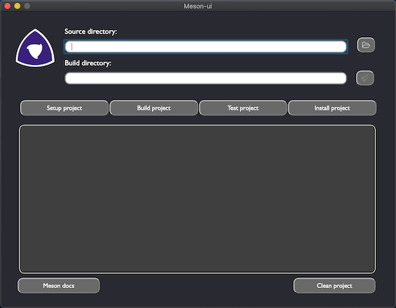
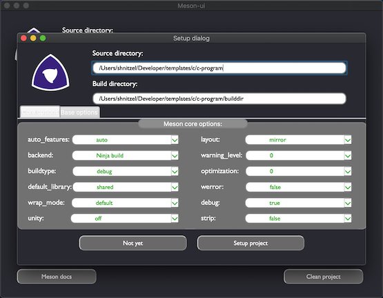
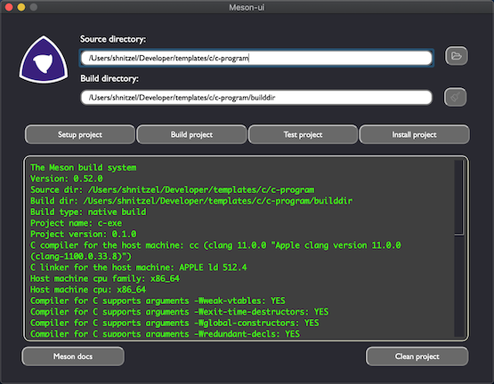
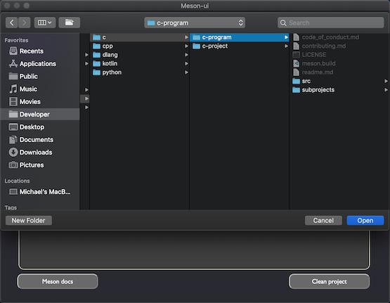
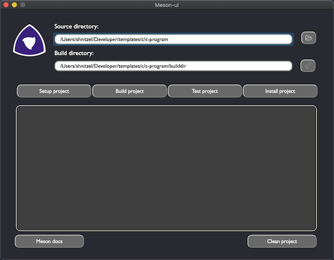
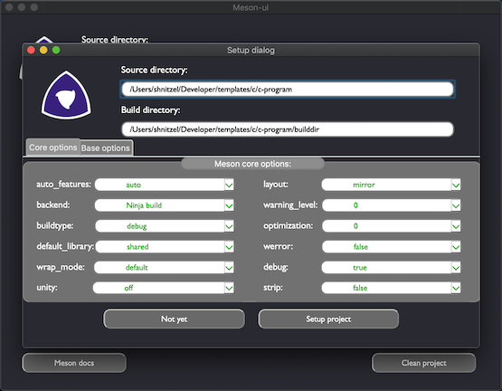

<p align="center">

</p>

* Meson-ui® is a GUI app for Meson a next-generation build system.
----------------------------------------

#### Status

[](https://github.com/michaelbadcrumble/meson-ui)
[](https://circleci.com/gh/michaelbadcrumble/meson-ui)


## About it

Meson-ui is a Graphical application designed to provide an interactive
way to use the Meson build system. We believe it is a nice way to get
CMake users comfortable with Meson.

The app was written in Python so that it can be OS egoistic and easy
to download.  The definition of easy to download can be explained with
the design of Meson-ui, witch was to be a command line plugin for Meson
meaning if you have Meson then by entering “meson” followed the Meson
arguments you would get totally normal Meson behavior but if you enter
“meson-ui” then the GUI would open to provide that needed graphical
experience to the users.


### Preview of the app.
<p align="center">

</p>

### Preview of the setup dialog.
<p align="center">

</p>

### Preview of the build.
<p align="center">

</p>


## Features

*   Multiplatform support for Linux, macOS, Windows, and others
*   Simple and esay to use user interface just for you.
*   Optimized for extremely fast and easy GUI.
*   Distributed under the Apache 2.0 license.
*   Works 99.95% out of the box.
*   fun!


## Development

All development on Meson-ui is done on the [GitHub project](https://github.com/michaelbadcrumble/meson-ui). 
Instructions for contributing can be found on the [contribution page](contributing.md).

You do not need to sign a CLA to contribute to Meson-ui.


### Downloading Required Dependencies

Meson-ui requires the following dependencies:

-----------------------------------------------------------------------------------
| Tool being used.                                     |  Version needed          |
|------------------------------------------------------|--------------------------|
| [Meson build system](https://mesonbuild.com)         | version 0.50.0 or newer. |
| [Python Language   ](https://python.org).            | version 3.6.0 or newer.  |
| [PyQt5             ](https://pypi.org/project/PyQt5/)| version 5.13.1 or newer. |


### Downloading Meson-ui.
--------

We recommended you use the Python 3 version of ‘pip’ to
install Meson-ui on to your system.

```console
pip3 install git+https://github.com/michaelbadcrumble/meson-ui#egg=meson-ui --user
```
<br>

You can also download Meson-ui directly from GitHub with this command:

```console
git clone https://github.com/michaelbadcrumble/meson-ui.git
```
<br>

PyInstaller support is currently being tested.


### Run Meson-ui.

To start the app, run this command:

```console
meson-ui
```

### How to use Meson-ui.

Let's start with the most basic of programs, the classic hello
example. First we need to clone the example project from [GitHub](https://github.com/michaelbadcrumble/c-project.git).

You can also use your Meson build project if you wish but in this 
tutorial I am using one of my C project templates.

We are now ready to build our application. First we need
to open the terminal and run the following commands.

```console
$ meson-ui
```

If you launched the app from the command line, you will see the 
application.  It looks somthing like this.

<p align="center">

</p>

Now to use **Meson-ui** for a simple build.  First enter the 
paths for source and build directory to your Meson project 
or click on open directory button with the pickture of a folder
on the lower right of the user interface.

<p align="center">

</p>

Meson is different from some other build systems in that it
does not permit in-source builds. You must always create a separate
build directory. Common convention is to put the default build directory 
in a subdirectory of your top level source directory.

<p align="center">
When you click **Setup** Meson-ui will print the following output.
</p>

<p align="center">

</p>

<p align="center">
Now we are ready to build our code.  Just click **Build** to build
the project.
</p>

<p align="center">

</p>

<p align="center">
Optionally you can run the test for the project by clicking **test**
button.
</p>

<p align="center">

</p>


And assuming you navigated to your project root directory you 
can run the resulting binary from the command line.

```console
$ ./path/to/c-exe
```

This produces the expected output.

```console
    Hello, C.
```

### Contact the developer.
==========================

#### Developer and maintainer

- gmail : [badcrumbles gmail](mailto:michaelbrockus@gmail.com)
- email : [badcrumbles email](mailto:michaelbrockus@icloud.com)

#### Happy planing.  Happy coding...
